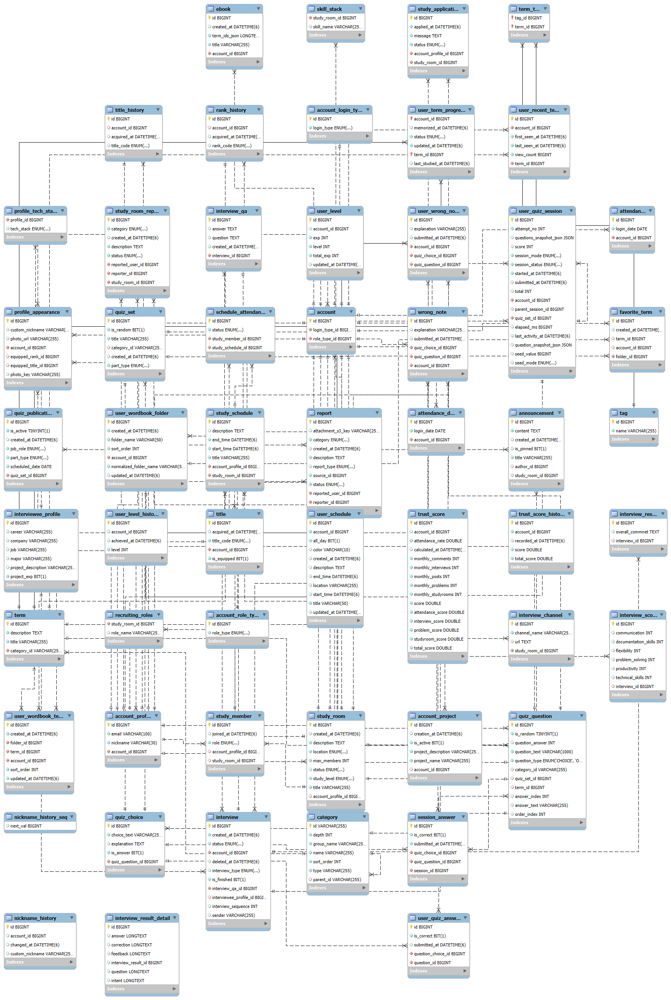

# 🥄 Jobspoon - Spring Backend

[](https://www.oracle.com/java/technologies/javase/jdk17-archive-downloads.html)
[](https://spring.io/projects/spring-boot)
[](https://github.com/Roto90-BackEnd/jobspoon-spring-backend)
[](./LICENSE)
[](https://github.com/Roto90-BackEnd/jobspoon-spring-backend)

Jobspoon은 IT 취업 준비생을 위한 **AI 면접 솔루션 및 스터디 플랫폼**입니다.
본 레포지토리는 Jobspoon 서비스의 Spring Boot 기반 백엔드 API 서버입니다.


## ✨ 4대 핵심 기능 (Features)

Jobspoon은 4개의 핵심 도메인을 중심으로 유기적으로 연결되어 있습니다.

### 1. 🤖 AI 모의면접 (Main Service)
> "AI로 검증하는 면접 솔루션"

AI를 통해 사용자의 면접을 분석하고 피드백을 제공하는 핵심 서비스입니다.
* [e.g., 면접 세트(질문) 생성 및 관리]
* [e.g., 면접 영상/음성 데이터 S3 업로드 API]
* [e.g., AI 분석 결과(STT 텍스트, 점수) 저장 및 조회]
* [e.g., 면접 유형(CS, 직무, 인성)별 질문 관리]

### 2. 🧑‍🤝‍🧑 스터디 모임 (Retention)
> "함께 성장하는 스터디 커뮤니티"

학습 리텐션을 유도하고 커뮤니티를 활성화하는 서브 도메인입니다.
* 스터디 그룹 생성, 검색, 참여 및 관리
* 스터디별 공지사항 및 캘린더 기반 **일정 관리**
* 스터디 리더를 위한 **신청 관리** (가입 승인/거절)
* 일정별 **출석 관리** (멤버별 출석/결석/대기 상태 처리)

### 3. 🧠 스푼워드 (Learning)
> "매일매일 학습하는 IT 지식 퀴즈"

지속적인 학습 동기를 부여하는 퀴즈 및 학습 콘텐츠입니다.
* [e.g., 일일/주간 CS/직무 퀴즈 제공]
* [e.g., 사용자 답변 제출 및 정답 처리]
* [e.g., 퀴즈 기반 학습 점수 및 랭킹 시스템]

### 4. 📊 마이페이지 (Profile & Stats)
> "한눈에 보는 나의 성장 기록"

모든 서비스의 활동 데이터를 통계로 관리하고 프로필을 제공합니다.
* 사용자 프로필(닉네임, 프로필 이미지) 수정
* 서비스별(면접, 스푼워드) 획득 점수 및 통계 데이터 집계
* 나의 스터디 현황 및 학습 캘린더(일정, 출석 현황) 조회

## 🛠️ 기술 스택 (Tech Stack)

| Category | Stack | Description |
| :--- | :--- | :--- |
| **Language** | Java [17] | |
| **Framework** | Spring Boot [3.5.3] | |
| **Security** | Spring Security | 커스텀 필터 기반 토큰 인증/인가 |
| **In-Memory** | Redis | 인증 토큰 저장소(Opaque Token), 랭킹, 캐시관리 |
| **Database** | MySQL | 메인 데이터베이스 |
| **ORM** | Spring Data JPA | |
| **Build** | [Gradle] | |
| **API Docs** | SpringDoc OpenAPI 3.0 | ` /swagger-ui.html ` |
| **Etc** | Lombok | |
| | [AWS S3] | [e.g., 프로필 이미지, 신고 파일 등] |

## 🚀 로컬 실행 방법 (Getting Started)

### 1. 전제 조건 (Prerequisites)

* Java `[17]` (JDK 17)
* `[Gradle]`
* `[MySQL]`
* `[Redis]`
* `IDE (IntelliJ)`

### 2. 실행 가이드 (Running Locally)

1.  **레포지토리 클론**
    ```bash
    git clone [https://github.com/Roto90-BackEnd/jobspoon-spring-backend.git](https://github.com/Roto90-BackEnd/jobspoon-spring-backend.git)
    cd jobspoon-spring-backend
    ```

2.  **보안 설정 파일 생성 (`.env`)**

    본 프로젝트는 모든 민감 정보(DB비밀번호, API키 등)를 `.env` 파일로 관리합니다.
    레포지토리에 포함된 **`.env.example`** 파일을 **`.env`** 파일로 복사하세요.

    ```bash
    cp .env.example .env
    ```

3.  **`.env` 파일 수정**

    방금 생성한 `.env` 파일을 열어, 본인의 로컬 개발 환경에 맞게 `[ ]`로 표시된 값들을 채워주세요. (e.g., 로컬 DB 비밀번호, Kakao/GitHub API 키 등)

    ```ini
    # .env
    SPRING_DATABASE_USER=my_local_db_user
    SPRING_DATABASE_PASSWORD=my_local_db_password
    SPRING_DATA_REDIS_PASSWORD=my_local_redis_password
    KAKAO_CLIENT_ID=abcdefg...
    ...
    ```

4.  **빌드 및 실행**
    ```bash
    ./gradlew build
    java -jar build/libs/[생성된_jar_파일_이름].jar
    ```
    *또는 IDE에서 `JobspoonSpringBackendApplication` 클래스를 직접 실행합니다.*

5.  **확인**
    * 서버가 `http://localhost:8080` (기본값)에서 실행됩니다.
    * API 문서는 `http://localhost:8080/swagger-ui.html` 에서 확인합니다.

## 📖 API 문서 (API Documentation)

현재 Spring Boot `3.5.3` 버전과 `springdoc:2.5.0` 라이브러리 간의 호환성 이슈로 인해,
` /swagger-ui.html ` 엔드포인트가 `500 Internal Server Error`를 반환하고 있습니다.

**[임시 조치]**
* API 테스트가 필요한 경우, Postman이나 HTTPie 같은 별도의 API 클라이언트를 사용해 주시기 바랍니다.

**[향후 계획]**
* Spring Boot가 안정적인 버전(e.g., `3.4.x` stable)으로 업데이트되거나, `springdoc` 라이브러리의 다음 버전이 릴리즈되어 호환성 문제가 해결되면 Swagger UI를 복구할 예정입니다.

## 🏛️ 데이터베이스 스키마 (Database Schema)

본 프로젝트의 전체 데이터베이스 ERD는 아래와 같습니다.
(이 다이어그램은 `DB.mwb` 파일로부터 생성되었습니다.)

 
---

## 🏛️ 데이터베이스 스키마 (Database Schema)

본 프로젝트의 전체 데이터베이스 ERD는 아래와 같습니다.
(이 다이어그램은 `DB.mwb` 파일로부터 생성되었습니다.)

 
---

### 데이터 스키마 (DDL)

MySQL Workbench에서 생성된 전체 스키마 DDL(Data Definition Language)은 다음과 같습니다.

```sql
-- MySQL Script generated by MySQL Workbench
-- Fri Nov  7 13:13:39 2025
-- Model: New Model    Version: 1.0
-- MySQL Workbench Forward Engineering

SET @OLD_UNIQUE_CHECKS=@@UNIQUE_CHECKS, UNIQUE_CHECKS=0;
SET @OLD_FOREIGN_KEY_CHECKS=@@FOREIGN_KEY_CHECKS, FOREIGN_KEY_CHECKS=0;
SET @OLD_SQL_MODE=@@SQL_MODE, SQL_MODE='ONLY_FULL_GROUP_BY,STRICT_TRANS_TABLES,NO_ZERO_IN_DATE,NO_ZERO_DATE,ERROR_FOR_DIVISION_BY_ZERO,NO_ENGINE_SUBSTITUTION';

-- -----------------------------------------------------
-- Schema aim_db
-- -----------------------------------------------------
CREATE SCHEMA IF NOT EXISTS `aim_db` DEFAULT CHARACTER SET utf8mb4 COLLATE utf8mb4_0900_ai_ci ;
USE `aim_db` ;

-- -----------------------------------------------------
-- Table `aim_db`.`account_role_type`
-- -----------------------------------------------------
CREATE TABLE IF NOT EXISTS `aim_db`.`account_role_type` (
  `id` BIGINT NOT NULL AUTO_INCREMENT,
  `role_type` ENUM('ADMIN', 'USER') NOT NULL,
  PRIMARY KEY (`id`))
ENGINE = InnoDB
AUTO_INCREMENT = 3
DEFAULT CHARACTER SET = utf8mb4
COLLATE = utf8mb4_0900_ai_ci;


-- -----------------------------------------------------
-- Table `aim_db`.`account_login_type`
-- -----------------------------------------------------
CREATE TABLE IF NOT EXISTS `aim_db`.`account_login_type` (
  `id` BIGINT NOT NULL AUTO_INCREMENT,
  `login_type` ENUM('GITHUB', 'GOOGLE', 'KAKAO', 'META', 'NAVER') NOT NULL,
  PRIMARY KEY (`id`))
ENGINE = InnoDB
AUTO_INCREMENT = 6
DEFAULT CHARACTER SET = utf8mb4
COLLATE = utf8mb4_0900_ai_ci;


-- -----------------------------------------------------
-- Table `aim_db`.`account`
-- -----------------------------------------------------
CREATE TABLE IF NOT EXISTS `aim_db`.`account` (
  `id` BIGINT NOT NULL AUTO_INCREMENT,
  `login_type_id` BIGINT NOT NULL,
  `role_type_id` BIGINT NOT NULL,
  PRIMARY KEY (`id`),
  INDEX `FKn7lduhki2bem8q83ir544ocq4` (`login_type_id` ASC) VISIBLE,
  INDEX `FKblsirh2q1k1mlnwsr3nlkwdc7` (`role_type_id` ASC) VISIBLE,
  CONSTRAINT `FKblsirh2q1k1mlnwsr3nlkwdc7`
    FOREIGN KEY (`role_type_id`)
    REFERENCES `aim_db`.`account_role_type` (`id`),
  CONSTRAINT `FKn7lduhki2bem8q83ir544ocq4`
    FOREIGN KEY (`login_type_id`)
    REFERENCES `aim_db`.`account_login_type` (`id`))
ENGINE = InnoDB
AUTO_INCREMENT = 7
DEFAULT CHARACTER SET = utf8mb4
COLLATE = utf8mb4_0900_ai_ci;


-- -----------------------------------------------------
-- Table `aim_db`.`account_profile`
-- -----------------------------------------------------
CREATE TABLE IF NOT EXISTS `aim_db`.`account_profile` (
  `id` BIGINT NOT NULL AUTO_INCREMENT,
  `email` VARCHAR(100) NOT NULL,
  `nickname` VARCHAR(30) NOT NULL,
  `account_id` BIGINT NOT NULL,
  PRIMARY KEY (`id`),
  UNIQUE INDEX `UK6u3xkxg2k12lwoo7yadguugmb` (`email` ASC) VISIBLE,
  UNIQUE INDEX `UKr3qi55pb5s42m9hk3u0qen1lk` (`nickname` ASC) VISIBLE,
  UNIQUE INDEX `UKpfm098mqligo1wpd1403e4240` (`account_id` ASC) VISIBLE,
  CONSTRAINT `FK2cokvjm0gl85mk5x0yibe0r05`
    FOREIGN KEY (`account_id`)
    REFERENCES `aim_db`.`account` (`id`))
ENGINE = InnoDB
AUTO_INCREMENT = 7
DEFAULT CHARACTER SET = utf8mb4
COLLATE = utf8mb4_0900_ai_ci;


-- -----------------------------------------------------
-- Table `aim_db`.`account_project`
-- -----------------------------------------------------
CREATE TABLE IF NOT EXISTS `aim_db`.`account_project` (
  `id` BIGINT NOT NULL AUTO_INCREMENT,
  `creation_at` DATETIME(6) NULL DEFAULT NULL,
  `is_active` BIT(1) NOT NULL,
  `project_description` VARCHAR(255) NOT NULL,
  `project_name` VARCHAR(255) NOT NULL,
  `account_id` BIGINT NULL DEFAULT NULL,
  PRIMARY KEY (`id`),
  INDEX `FK5dcwultf1am1wvhkekbasarn1` (`account_id` ASC) VISIBLE,
  CONSTRAINT `FK5dcwultf1am1wvhkekbasarn1`
    FOREIGN KEY (`account_id`)
    REFERENCES `aim_db`.`account` (`id`))
ENGINE = InnoDB
DEFAULT CHARACTER SET = utf8mb4
COLLATE = utf8mb4_0900_ai_ci;


-- -----------------------------------------------------
-- Table `aim_db`.`study_room`
-- -----------------------------------------------------
CREATE TABLE IF NOT EXISTS `aim_db`.`study_room` (
  `id` BIGINT NOT NULL AUTO_INCREMENT,
  `created_at` DATETIME(6) NULL DEFAULT NULL,
  `description` TEXT NOT NULL,
  `location` ENUM('BUSAN', 'CHUNGBUK', 'CHUNGNAM', 'DAEGU', 'DAEJEON', 'GANGWON', 'GWANGJU', 'GYEONGBUK', 'GYEONGGI', 'GYEONGNAM', 'INCHEON', 'JEJU', 'JEONBUK', 'JEONNAM', 'ONLINE', 'SEJONG', 'SEOUL', 'ULSAN') NOT NULL,
  `max_members` INT NOT NULL,
  `status` ENUM('RECRUITING', 'CLOSED', 'COMPLETED') NULL DEFAULT NULL,
  `study_level` ENUM('ALL', 'JUNIOR', 'MID', 'NEWBIE', 'SENIOR') NOT NULL,
  `title` VARCHAR(255) NOT NULL,
  `account_profile_id` BIGINT NULL DEFAULT NULL,
  PRIMARY KEY (`id`),
  INDEX `FKsvhtyko3kjx1xmwiesm8l9rj3` (`account_profile_id` ASC) VISIBLE,
  CONSTRAINT `FKsvhtyko3kjx1xmwiesm8l9rj3`
    FOREIGN KEY (`account_profile_id`)
    REFERENCES `aim_db`.`account_profile` (`id`))
ENGINE = InnoDB
AUTO_INCREMENT = 18
DEFAULT CHARACTER SET = utf8mb4
COLLATE = utf8mb4_0900_ai_ci;


-- -----------------------------------------------------
-- Table `aim_db`.`announcement`
-- -----------------------------------------------------
CREATE TABLE IF NOT EXISTS `aim_db`.`announcement` (
  `id` BIGINT NOT NULL AUTO_INCREMENT,
  `content` TEXT NOT NULL,
  `created_at` DATETIME(6) NULL DEFAULT NULL,
  `is_pinned` BIT(1) NULL DEFAULT NULL,
  `title` VARCHAR(255) NOT NULL,
  `author_id` BIGINT NULL DEFAULT NULL,
  `study_room_id` BIGINT NULL DEFAULT NULL,
  PRIMARY KEY (`id`),
  INDEX `FKq5hf3t7kdknxedxglfwoai39u` (`author_id` ASC) VISIBLE,
  INDEX `FKnj6faf4717wy3yrqy8ah44ru9` (`study_room_id` ASC) VISIBLE,
  CONSTRAINT `FKnj6faf4717wy3yrqy8ah44ru9`
    FOREIGN KEY (`study_room_id`)
    REFERENCES `aim_db`.`study_room` (`id`),
  CONSTRAINT `FKq5hf3t7kdknxedxglfwoai39u`
    FOREIGN KEY (`author_id`)
    REFERENCES `aim_db`.`account_profile` (`id`))
ENGINE = InnoDB
AUTO_INCREMENT = 61
DEFAULT CHARACTER SET = utf8mb4
COLLATE = utf8mb4_0900_ai_ci;


-- -----------------------------------------------------
-- Table `aim_db`.`attendance`
-- -----------------------------------------------------
CREATE TABLE IF NOT EXISTS `aim_db`.`attendance` (
  `id` BIGINT NOT NULL AUTO_INCREMENT,
  `login_date` DATE NOT NULL,
  `account_id` BIGINT NOT NULL,
  PRIMARY KEY (`id`),
  UNIQUE INDEX `uk_attendance_day` (`account_id` ASC, `login_date` ASC) VISIBLE,
  CONSTRAINT `FKh16lg6do6rf1tgq6i1tpau8tr`
    FOREIGN KEY (`account_id`)
    REFERENCES `aim_db`.`account` (`id`))
ENGINE = InnoDB
AUTO_INCREMENT = 4
DEFAULT CHARACTER SET = utf8mb4
COLLATE = utf8mb4_0900_ai_ci;


-- -----------------------------------------------------
-- Table `aim_db`.`attendance_day`
-- -----------------------------------------------------
CREATE TABLE IF NOT EXISTS `aim_db`.`attendance_day` (
  `id` BIGINT NOT NULL AUTO_INCREMENT,
  `login_date` DATE NOT NULL,
  `account_id` BIGINT NOT NULL,
  PRIMARY KEY (`id`),
  UNIQUE INDEX `uk_attendance_day` (`account_id` ASC, `login_date` ASC) VISIBLE,
  CONSTRAINT `FK21wt4qaafhvluc43s3t1ogvai`
    FOREIGN KEY (`account_id`)
    REFERENCES `aim_db`.`account` (`id`))
ENGINE = InnoDB
DEFAULT CHARACTER SET = utf8mb4
COLLATE = utf8mb4_0900_ai_ci;


-- -----------------------------------------------------
-- Table `aim_db`.`category`
-- -----------------------------------------------------
CREATE TABLE IF NOT EXISTS `aim_db`.`category` (
  `id` VARCHAR(255) NOT NULL,
  `depth` INT NOT NULL,
  `group_name` VARCHAR(255) NOT NULL,
  `name` VARCHAR(255) NOT NULL,
  `sort_order` INT NOT NULL,
  `type` VARCHAR(255) NOT NULL,
  `parent_id` VARCHAR(255) NULL DEFAULT NULL,
  PRIMARY KEY (`id`),
  UNIQUE INDEX `uk_category_name_depth` (`name` ASC, `depth` ASC) VISIBLE,
  INDEX `FK2y94svpmqttx80mshyny85wqr` (`parent_id` ASC) VISIBLE,
  CONSTRAINT `FK2y94svpmqttx80mshyny85wqr`
    FOREIGN KEY (`parent_id`)
    REFERENCES `aim_db`.`category` (`id`))
ENGINE = InnoDB
DEFAULT CHARACTER SET = utf8mb4
COLLATE = utf8mb4_0900_ai_ci;


-- -----------------------------------------------------
-- Table `aim_db`.`ebook`
-- -----------------------------------------------------
CREATE TABLE IF NOT EXISTS `aim_db`.`ebook` (
  `id` BIGINT NOT NULL AUTO_INCREMENT,
  `created_at` DATETIME(6) NULL DEFAULT NULL,
  `term_ids_json` LONGTEXT NOT NULL,
  `title` VARCHAR(255) NOT NULL,
  `account_id` BIGINT NOT NULL,
  PRIMARY KEY (`id`),
  INDEX `FKtmex29hfvso81l16d6lojf25t` (`account_id` ASC) VISIBLE,
  CONSTRAINT `FKtmex29hfvso81l16d6lojf25t`
    FOREIGN KEY (`account_id`)
    REFERENCES `aim_db`.`account` (`id`))
ENGINE = InnoDB
DEFAULT CHARACTER SET = utf8mb4
COLLATE = utf8mb4_0900_ai_ci;


-- -----------------------------------------------------
-- Table `aim_db`.`term`
-- -----------------------------------------------------
CREATE TABLE IF NOT EXISTS `aim_db`.`term` (
  `id` BIGINT NOT NULL AUTO_INCREMENT,
  `description` TEXT NOT NULL,
  `title` VARCHAR(255) NOT NULL,
  `category_id` VARCHAR(255) NOT NULL,
  PRIMARY KEY (`id`),
  INDEX `FKecnys03gtmrsa9kqrw43xu5rd` (`category_id` ASC) VISIBLE,
  CONSTRAINT `FKecnys03gtmrsa9kqrw43xu5rd`
    FOREIGN KEY (`category_id`)
    REFERENCES `aim_db`.`category` (`id`))
ENGINE = InnoDB
DEFAULT CHARACTER SET = utf8mb4
COLLATE = utf8mb4_0900_ai_ci;


-- -----------------------------------------------------
-- Table `aim_db`.`user_wordbook_folder`
-- -----------------------------------------------------
CREATE TABLE IF NOT EXISTS `aim_db`.`user_wordbook_folder` (
  `id` BIGINT NOT NULL AUTO_INCREMENT,
  `created_at` DATETIME(6) NOT NULL,
  `folder_name` VARCHAR(50) NOT NULL,
  `sort_order` INT NOT NULL,
  `account_id` BIGINT NOT NULL,
  `normalized_folder_name` VARCHAR(50) NOT NULL,
  `updated_at` DATETIME(6) NULL DEFAULT NULL,
  PRIMARY KEY (`id`),
  UNIQUE INDEX `uk_folder_owner_normalized` (`account_id` ASC, `normalized_folder_name` ASC) VISIBLE,
  CONSTRAINT `FK2ur8ywc1pxw3r0kic8v9aba63`
    FOREIGN KEY (`account_id`)
    REFERENCES `aim_db`.`account` (`id`))
ENGINE = InnoDB
DEFAULT CHARACTER SET = utf8mb4
COLLATE = utf8mb4_0900_ai_ci;


-- -----------------------------------------------------
-- Table `aim_db`.`favorite_term`
-- -----------------------------------------------------
CREATE TABLE IF NOT EXISTS `aim_db`.`favorite_term` (
  `id` BIGINT NOT NULL AUTO_INCREMENT,
  `created_at` DATETIME(6) NULL DEFAULT NULL,
  `term_id` BIGINT NULL DEFAULT NULL,
  `account_id` BIGINT NULL DEFAULT NULL,
  `folder_id` BIGINT NOT NULL,
  PRIMARY KEY (`id`),
  INDEX `FKahlwvgeq18hnw6n1yygxluuq3` (`term_id` ASC) VISIBLE,
  INDEX `FKfybrinbr6w4akxhqdxtmmusry` (`account_id` ASC) VISIBLE,
  INDEX `FKmpg4pp9h7k7j3pd6t8r6pwsxc` (`folder_id` ASC) VISIBLE,
  CONSTRAINT `FKahlwvgeq18hnw6n1yygxluuq3`
    FOREIGN KEY (`term_id`)
    REFERENCES `aim_db`.`term` (`id`),
  CONSTRAINT `FKfybrinbr6w4akxhqdxtmmusry`
    FOREIGN KEY (`account_id`)
    REFERENCES `aim_db`.`account` (`id`),
  CONSTRAINT `FKmpg4pp9h7k7j3pd6t8r6pwsxc`
    FOREIGN KEY (`folder_id`)
    REFERENCES `aim_db`.`user_wordbook_folder` (`id`))
ENGINE = InnoDB
DEFAULT CHARACTER SET = utf8mb4
COLLATE = utf8mb4_0900_ai_ci;


-- -----------------------------------------------------
-- Table `aim_db`.`interviewee_profile`
-- -----------------------------------------------------
CREATE TABLE IF NOT EXISTS `aim_db`.`interviewee_profile` (
  `id` BIGINT NOT NULL AUTO_INCREMENT,
  `career` VARCHAR(255) NULL DEFAULT NULL,
  `company` VARCHAR(255) NULL DEFAULT NULL,
  `job` VARCHAR(255) NULL DEFAULT NULL,
  `major` VARCHAR(255) NULL DEFAULT NULL,
  `project_description` VARCHAR(255) NULL DEFAULT NULL,
  `project_exp` BIT(1) NOT NULL,
  PRIMARY KEY (`id`))
ENGINE = InnoDB
DEFAULT CHARACTER SET = utf8mb4
COLLATE = utf8mb4_0900_ai_ci;


-- -----------------------------------------------------
-- Table `aim_db`.`interview_qa`
-- -----------------------------------------------------
CREATE TABLE IF NOT EXISTS `aim_db`.`interview_qa` (
  `id` BIGINT NOT NULL AUTO_INCREMENT,
  `answer` TEXT NULL DEFAULT NULL,
  `question` TEXT NULL DEFAULT NULL,
  `created_at` DATETIME(6) NULL DEFAULT NULL,
  `interview_id` BIGINT NOT NULL,
  PRIMARY KEY (`id`),
  INDEX `FKd2i9k56wkurm1ecuxx6204pe4` (`interview_id` ASC) VISIBLE,
  CONSTRAINT `FKd2i9k56wkurm1ecuxx6204pe4`
    FOREIGN KEY (`interview_id`)
    REFERENCES `aim_db`.`interview` (`id`))
ENGINE = InnoDB
DEFAULT CHARACTER SET = utf8mb4
COLLATE = utf8mb4_0900_ai_ci;


-- -----------------------------------------------------
-- Table `aim_db`.`interview`
-- -----------------------------------------------------
CREATE TABLE IF NOT EXISTS `aim_db`.`interview` (
  `id` BIGINT NOT NULL AUTO_INCREMENT,
  `created_at` DATETIME(6) NOT NULL,
  `status` ENUM('COMPLETED', 'IN_PROGRESS') NOT NULL,
  `account_id` BIGINT NOT NULL,
  `deleted_at` DATETIME(6) NULL DEFAULT NULL,
  `interview_type` ENUM('COMPANY', 'TECHNICAL') NULL DEFAULT NULL,
  `is_finished` BIT(1) NOT NULL,
  `interview_qa_id` BIGINT NOT NULL,
  `interviewee_profile_id` BIGINT NULL DEFAULT NULL,
  `interview_sequence` INT NULL DEFAULT NULL,
  `sender` VARCHAR(255) NULL DEFAULT NULL,
  PRIMARY KEY (`id`),
  UNIQUE INDEX `UKlmohcnyx49n31lt378dp3yh56` (`interviewee_profile_id` ASC) VISIBLE,
  INDEX `FKlv2dkn5q4wf7e4kpqa22kwqcw` (`account_id` ASC) VISIBLE,
  INDEX `FKm5u6j8hh9wnh2fi610suybht0` (`interview_qa_id` ASC) VISIBLE,
  CONSTRAINT `FK979isqendxsqxvgk90fd3rnsx`
    FOREIGN KEY (`interviewee_profile_id`)
    REFERENCES `aim_db`.`interviewee_profile` (`id`),
  CONSTRAINT `FKlv2dkn5q4wf7e4kpqa22kwqcw`
    FOREIGN KEY (`account_id`)
    REFERENCES `aim_db`.`account` (`id`),
  CONSTRAINT `FKm5u6j8hh9wnh2fi610suybht0`
    FOREIGN KEY (`interview_qa_id`)
    REFERENCES `aim_db`.`interview_qa` (`id`))
ENGINE = InnoDB
DEFAULT CHARACTER SET = utf8mb4
COLLATE = utf8mb4_0900_ai_ci;


-- -----------------------------------------------------
-- Table `aim_db`.`interview_channel`
-- -----------------------------------------------------
CREATE TABLE IF NOT EXISTS `aim_db`.`interview_channel` (
  `id` BIGINT NOT NULL AUTO_INCREMENT,
  `channel_name` VARCHAR(255) NOT NULL,
  `url` TEXT NULL DEFAULT NULL,
  `study_room_id` BIGINT NOT NULL,
  PRIMARY KEY (`id`),
  INDEX `FKt8v58l8y0wvrleesy57rbfdld` (`study_room_id` ASC) VISIBLE,
  CONSTRAINT `FKt8v58l8y0wvrleesy57rbfdld`
    FOREIGN KEY (`study_room_id`)
    REFERENCES `aim_db`.`study_room` (`id`))
ENGINE = InnoDB
AUTO_INCREMENT = 16
DEFAULT CHARACTER SET = utf8mb4
COLLATE = utf8mb4_0900_ai_ci;


-- -----------------------------------------------------
-- Table `aim_db`.`interview_result`
-- -----------------------------------------------------
CREATE TABLE IF NOT EXISTS `aim_db`.`interview_result` (
  `id` BIGINT NOT NULL AUTO_INCREMENT,
  `overall_commnet` TEXT NULL DEFAULT NULL,
  `interview_id` BIGINT NULL DEFAULT NULL,
  PRIMARY KEY (`id`),
  UNIQUE INDEX `UKp6bsdmqvol8p80x4c66nq5ko1` (`interview_id` ASC) VISIBLE,
  CONSTRAINT `FK85ao715si8h2pep18dklj6qi1`
    FOREIGN KEY (`interview_id`)
    REFERENCES `aim_db`.`interview` (`id`))
ENGINE = InnoDB
DEFAULT CHARACTER SET = utf8mb4
COLLATE = utf8mb4_0900_ai_ci;


-- -----------------------------------------------------
-- Table `aim_db`.`interview_result_detail`
-- -----------------------------------------------------
CREATE TABLE IF NOT EXISTS `aim_db`.`interview_result_detail` (
  `id` BIGINT NOT NULL AUTO_INCREMENT,
  `answer` LONGTEXT NULL DEFAULT NULL,
  `correction` LONGTEXT NULL DEFAULT NULL,
  `feedback` LONGTEXT NULL DEFAULT NULL,
  `interview_result_id` BIGINT NULL DEFAULT NULL,
  `question` LONGTEXT NULL DEFAULT NULL,
  `intent` LONGTEXT NULL DEFAULT NULL,
  PRIMARY KEY (`id`))
ENGINE = InnoDB
DEFAULT CHARACTER SET = utf8mb4
COLLATE = utf8mb4_0900_ai_ci;


-- -----------------------------------------------------
-- Table `aim_db`.`interview_score`
-- -----------------------------------------------------
CREATE TABLE IF NOT EXISTS `aim_db`.`interview_score` (
  `id` BIGINT NOT NULL AUTO_INCREMENT,
  `communication` INT NULL DEFAULT NULL,
  `documentation_skills` INT NULL DEFAULT NULL,
  `flexibility` INT NULL DEFAULT NULL,
  `problem_solving` INT NULL DEFAULT NULL,
  `productivity` INT NULL DEFAULT NULL,
  `technical_skills` INT NULL DEFAULT NULL,
  `interview_id` BIGINT NULL DEFAULT NULL,
  PRIMARY KEY (`id`),
  UNIQUE INDEX `UK755kk9qhj1ehuj1h55ndmtu89` (`interview_id` ASC) VISIBLE,
  CONSTRAINT `FKgvmo4do9ld2f4cskapbfo1luq`
    FOREIGN KEY (`interview_id`)
    REFERENCES `aim_db`.`interview` (`id`))
ENGINE = InnoDB
DEFAULT CHARACTER SET = utf8mb4
COLLATE = utf8mb4_0900_ai_ci;


-- -----------------------------------------------------
-- Table `aim_db`.`nickname_history`
-- -----------------------------------------------------
CREATE TABLE IF NOT EXISTS `aim_db`.`nickname_history` (
  `id` BIGINT NOT NULL,
  `account_id` BIGINT NULL DEFAULT NULL,
  `changed_at` DATETIME(6) NULL DEFAULT NULL,
  `custom_nickname` VARCHAR(255) NULL DEFAULT NULL,
  PRIMARY KEY (`id`))
ENGINE = InnoDB
DEFAULT CHARACTER SET = utf8mb4
COLLATE = utf8mb4_0900_ai_ci;


-- -----------------------------------------------------
-- Table `aim_db`.`nickname_history_seq`
-- -----------------------------------------------------
CREATE TABLE IF NOT EXISTS `aim_db`.`nickname_history_seq` (
  `next_val` BIGINT NULL DEFAULT NULL)
ENGINE = InnoDB
DEFAULT CHARACTER SET = utf8mb4
COLLATE = utf8mb4_0900_ai_ci;


-- -----------------------------------------------------
-- Table `aim_db`.`title_history`
-- -----------------------------------------------------
CREATE TABLE IF NOT EXISTS `aim_db`.`title_history` (
  `id` BIGINT NOT NULL AUTO_INCREMENT,
  `account_id` BIGINT NULL DEFAULT NULL,
  `acquired_at` DATETIME(6) NULL DEFAULT NULL,
  `title_code` ENUM('EARLY_BIRD', 'LEGEND', 'MASTER') NULL DEFAULT NULL,
  PRIMARY KEY (`id`),
  INDEX `FK974x3dvx0staf42kg9llsexua` (`account_id` ASC) VISIBLE,
  CONSTRAINT `FK974x3dvx0staf42kg9llsexua`
    FOREIGN KEY (`account_id`)
    REFERENCES `aim_db`.`account` (`id`))
ENGINE = InnoDB
DEFAULT CHARACTER SET = utf8mb4
COLLATE = utf8mb4_0900_ai_ci;


-- -----------------------------------------------------
-- Table `aim_db`.`rank_history`
-- -----------------------------------------------------
CREATE TABLE IF NOT EXISTS `aim_db`.`rank_history` (
  `id` BIGINT NOT NULL AUTO_INCREMENT,
  `account_id` BIGINT NULL DEFAULT NULL,
  `acquired_at` DATETIME(6) NULL DEFAULT NULL,
  `rank_code` ENUM('BRONZE', 'GOLD', 'PLATINUM', 'SILVER') NULL DEFAULT NULL,
  PRIMARY KEY (`id`),
  INDEX `FK2dq8y9ji5uydaeu94yfiffvbp` (`account_id` ASC) VISIBLE,
  CONSTRAINT `FK2dq8y9ji5uydaeu94yfiffvbp`
    FOREIGN KEY (`account_id`)
    REFERENCES `aim_db`.`account` (`id`))
ENGINE = InnoDB
DEFAULT CHARACTER SET = utf8mb4
COLLATE = utf8mb4_0900_ai_ci;


-- -----------------------------------------------------
-- Table `aim_db`.`title`
-- -----------------------------------------------------
CREATE TABLE IF NOT EXISTS `aim_db`.`title` (
  `id` BIGINT NOT NULL AUTO_INCREMENT,
  `acquired_at` DATETIME(6) NULL DEFAULT NULL,
  `title_code` ENUM('BEGINNER', 'EARLY_BIRD', 'EXPERT', 'LEGEND') NOT NULL,
  `account_id` BIGINT NOT NULL,
  `is_equipped` BIT(1) NOT NULL,
  PRIMARY KEY (`id`),
  INDEX `FKp1kyhde3ra8kj97xe3leeacnv` (`account_id` ASC) VISIBLE,
  CONSTRAINT `FKp1kyhde3ra8kj97xe3leeacnv`
    FOREIGN KEY (`account_id`)
    REFERENCES `aim_db`.`account` (`id`))
ENGINE = InnoDB
DEFAULT CHARACTER SET = utf8mb4
COLLATE = utf8mb4_0900_ai_ci;


-- -----------------------------------------------------
-- Table `aim_db`.`profile_appearance`
-- -----------------------------------------------------
CREATE TABLE IF NOT EXISTS `aim_db`.`profile_appearance` (
  `id` BIGINT NOT NULL AUTO_INCREMENT,
  `custom_nickname` VARCHAR(8) NULL DEFAULT NULL,
  `photo_url` VARCHAR(255) NULL DEFAULT NULL,
  `account_id` BIGINT NOT NULL,
  `equipped_rank_id` BIGINT NULL DEFAULT NULL,
  `equipped_title_id` BIGINT NULL DEFAULT NULL,
  `photo_key` VARCHAR(255) NULL DEFAULT NULL,
  PRIMARY KEY (`id`),
  UNIQUE INDEX `UKd35pbj7mfdq46t6q032tot5jb` (`account_id` ASC) VISIBLE,
  UNIQUE INDEX `uk_custom_nickname` (`custom_nickname` ASC) VISIBLE,
  INDEX `FK72rkpd9pp1n5s4pdjo9aviy68` (`equipped_rank_id` ASC) VISIBLE,
  INDEX `FKqp3t6b07xwfeaa0udg20spjub` (`equipped_title_id` ASC) VISIBLE,
  CONSTRAINT `FK2a7ceoiqo8q41igp6rv1pajhg`
    FOREIGN KEY (`equipped_title_id`)
    REFERENCES `aim_db`.`title_history` (`id`),
  CONSTRAINT `FK72rkpd9pp1n5s4pdjo9aviy68`
    FOREIGN KEY (`equipped_rank_id`)
    REFERENCES `aim_db`.`rank_history` (`id`),
  CONSTRAINT `FKqp3t6b07xwfeaa0udg20spjub`
    FOREIGN KEY (`equipped_title_id`)
    REFERENCES `aim_db`.`title` (`id`),
  CONSTRAINT `FKqvdkhe7ykay17ltx1rs3s4ili`
    FOREIGN KEY (`account_id`)
    REFERENCES `aim_db`.`account_profile` (`id`))
ENGINE = InnoDB
DEFAULT CHARACTER SET = utf8mb4
COLLATE = utf8mb4_0900_ai_ci;


-- -----------------------------------------------------
-- Table `aim_db`.`profile_tech_stack`
-- -----------------------------------------------------
CREATE TABLE IF NOT EXISTS `aim_db`.`profile_tech_stack` (
  `profile_id` BIGINT NOT NULL,
  `tech_stack` ENUM('ANGULAR', 'API', 'ASP', 'AWS', 'BACKEND', 'BOOTSTRAP', 'FLUTTER', 'FRONTEND', 'FULLSTACK', 'GRAPHQL', 'HTML5', 'JAVA', 'JAVASCRIPT', 'JQUERY', 'JSP', 'MYSQL', 'NODEJS', 'PHP', 'PYTHON', 'REACTJS', 'VUEJS', 'WEB') NULL DEFAULT NULL,
  INDEX `FKojmpjes6vlqwkgkrs9xo7crma` (`profile_id` ASC) VISIBLE,
  CONSTRAINT `FKojmpjes6vlqwkgkrs9xo7crma`
    FOREIGN KEY (`profile_id`)
    REFERENCES `aim_db`.`interviewee_profile` (`id`))
ENGINE = InnoDB
DEFAULT CHARACTER SET = utf8mb4
COLLATE = utf8mb4_0900_ai_ci;


-- -----------------------------------------------------
-- Table `aim_db`.`quiz_set`
-- -----------------------------------------------------
CREATE TABLE IF NOT EXISTS `aim_db`.`quiz_set` (
  `id` BIGINT NOT NULL AUTO_INCREMENT,
  `is_random` BIT(1) NOT NULL,
  `title` VARCHAR(255) NOT NULL,
  `category_id` VARCHAR(255) NULL DEFAULT NULL,
  `created_at` DATETIME(6) NULL DEFAULT NULL,
  `part_type` ENUM('CHOICE', 'INITIALS', 'MIX', 'OX') NOT NULL,
  PRIMARY KEY (`id`),
  UNIQUE INDEX `UKelubd47nbfohd4qio3jlml9p7` (`title` ASC) VISIBLE,
  INDEX `FKmo88n3xfe0pohwimxvhcttmm9` (`category_id` ASC) VISIBLE,
  CONSTRAINT `FKmo88n3xfe0pohwimxvhcttmm9`
    FOREIGN KEY (`category_id`)
    REFERENCES `aim_db`.`category` (`id`))
ENGINE = InnoDB
DEFAULT CHARACTERSET = utf8mb4
COLLATE = utf8mb4_0900_ai_ci;


-- -----------------------------------------------------
-- Table `aim_db`.`quiz_question`
-- -----------------------------------------------------
CREATE TABLE IF NOT EXISTS `aim_db`.`quiz_question` (
  `id` BIGINT NOT NULL AUTO_INCREMENT,
  `is_random` TINYINT(1) NOT NULL DEFAULT '0',
  `question_answer` INT NULL DEFAULT NULL,
  `question_text` VARCHAR(1000) NOT NULL,
  `question_type` ENUM('CHOICE', 'OX') NOT NULL,
  `category_id` VARCHAR(255) NULL DEFAULT NULL,
  `quiz_set_id` BIGINT NULL DEFAULT NULL,
  `term_id` BIGINT NULL DEFAULT NULL,
  `answer_index` INT NULL DEFAULT NULL,
  `answer_text` VARCHAR(255) NULL DEFAULT NULL,
  `order_index` INT NULL DEFAULT NULL,
  PRIMARY KEY (`id`),
  INDEX `idx_quiz_question_set_order` (`quiz_set_id` ASC, `order_index` ASC) VISIBLE,
  INDEX `idx_quiz_question_category` (`category_id` ASC) VISIBLE,
  INDEX `idx_quiz_question_term` (`term_id` ASC) VISIBLE,
  CONSTRAINT `FKademupmkualcdnl7k8im0m6uo`
    FOREIGN KEY (`category_id`)
    REFERENCES `aim_db`.`category` (`id`),
  CONSTRAINT `FKbxucxnx7rva9bqxxsqua3ufid`
    FOREIGN KEY (`term_id`)
    REFERENCES `aim_db`.`term` (`id`),
  CONSTRAINT `FKd74d5e8pnlyoyue5jq2lew0vx`
    FOREIGN KEY (`quiz_set_id`)
    REFERENCES `aim_db`.`quiz_set` (`id`))
ENGINE = InnoDB
DEFAULT CHARACTER SET = utf8mb4
COLLATE = utf8mb4_0900_ai_ci;


-- -----------------------------------------------------
-- Table `aim_db`.`quiz_choice`
-- -----------------------------------------------------
CREATE TABLE IF NOT EXISTS `aim_db`.`quiz_choice` (
  `id` BIGINT NOT NULL AUTO_INCREMENT,
  `choice_text` VARCHAR(255) NOT NULL,
  `explanation` TEXT NULL DEFAULT NULL,
  `is_answer` BIT(1) NOT NULL,
  `quiz_question_id` BIGINT NOT NULL,
  PRIMARY KEY (`id`),
  INDEX `FKp06k7du6oyjepw70n1wbb8noo` (`quiz_question_id` ASC) VISIBLE,
  CONSTRAINT `FKp06k7du6oyjepw70n1wbb8noo`
    FOREIGN KEY (`quiz_question_id`)
    REFERENCES `aim_db`.`quiz_question` (`id`))
ENGINE = InnoDB
DEFAULT CHARACTER SET = utf8mb4
COLLATE = utf8mb4_0900_ai_ci;


-- -----------------------------------------------------
-- Table `aim_db`.`quiz_publication`
-- -----------------------------------------------------
CREATE TABLE IF NOT EXISTS `aim_db`.`quiz_publication` (
  `id` BIGINT NOT NULL AUTO_INCREMENT,
  `is_active` TINYINT(1) NOT NULL DEFAULT '1',
  `created_at` DATETIME(6) NULL DEFAULT NULL,
  `job_role` ENUM('AI_DATA_MACHINE_LEARNING', 'BACKEND', 'COMPUTER_SCIENCE', 'DATABASE', 'DATA_STRUCTURES_ALGORITHMS', 'DEVOPS_CLOUD', 'EMBEDDED_IOT_SYSTEM_PROGRAMMING', 'FRONTEND', 'GENERAL', 'NETWORK', 'OPERATING_SYSTEM', 'SECURITY', 'SOFTWARE_ENGINEERING') NOT NULL,
  `part_type` ENUM('CHOICE', 'INITIALS', 'MIX', 'OX') NOT NULL,
  `scheduled_date` DATE NOT NULL,
  `quiz_set_id` BIGINT NOT NULL,
  PRIMARY KEY (`id`),
  UNIQUE INDEX `uk_pub_date_part_role` (`scheduled_date` ASC, `part_type` ASC, `job_role` ASC) VISIBLE,
  INDEX `FKoldwd1cchl3nefxngpljv71vy` (`quiz_set_id` ASC) VISIBLE,
  CONSTRAINT `FKoldwd1cchl3nefxngpljv71vy`
    FOREIGN KEY (`quiz_set_id`)
    REFERENCES `aim_db`.`quiz_set` (`id`))
ENGINE = InnoDB
DEFAULT CHARACTER SET = utf8mb4
COLLATE = utf8mb4_0900_ai_ci;


-- -----------------------------------------------------
-- Table `aim_db`.`recruiting_roles`
-- -----------------------------------------------------
CREATE TABLE IF NOT EXISTS `aim_db`.`recruiting_roles` (
  `study_room_id` BIGINT NOT NULL,
  `role_name` VARCHAR(255) NULL DEFAULT NULL,
  INDEX `FKouvltr385j7lny8ap6yv4d9gn` (`study_room_id` ASC) VISIBLE,
  CONSTRAINT `FKouvltr385j7lny8ap6yv4d9gn`
    FOREIGN KEY (`study_room_id`)
    REFERENCES `aim_db`.`study_room` (`id`))
ENGINE = InnoDB
DEFAULT CHARACTER SET = utf8mb4
COLLATE = utf8mb4_0900_ai_ci;


-- -----------------------------------------------------
-- Table `aim_db`.`report`
-- -----------------------------------------------------
CREATE TABLE IF NOT EXISTS `aim_db`.`report` (
  `id` BIGINT NOT NULL AUTO_INCREMENT,
  `attachment_s3_key` VARCHAR(255) NULL DEFAULT NULL,
  `category` ENUM('ETC', 'HARASSMENT', 'INAPPROPRIATE_CONTENT', 'OFF_TOPIC', 'SPAM') NOT NULL,
  `created_at` DATETIME(6) NULL DEFAULT NULL,
  `description` TEXT NOT NULL,
  `report_type` ENUM('BOARD_POST', 'STUDY_ROOM') NULL DEFAULT NULL,
  `source_id` BIGINT NOT NULL,
  `status` ENUM('IN_PROGRESS', 'PENDING', 'RESOLVED') NOT NULL,
  `reported_user_id` BIGINT NOT NULL,
  `reporter_id` BIGINT NOT NULL,
  PRIMARY KEY (`id`),
  INDEX `FKpfo20gnrjw2y0dwv9no8rwt84` (`reported_user_id` ASC) VISIBLE,
  INDEX `FK1i04fjwqdcfhsdlla69n91oql` (`reporter_id` ASC) VISIBLE,
  CONSTRAINT `FK1i04fjwqdcfhsdlla69n91oql`
    FOREIGN KEY (`reporter_id`)
    REFERENCES `aim_db`.`account_profile` (`id`),
  CONSTRAINT `FKpfo20gnrjw2y0dwv9no8rwt84`
    FOREIGN KEY (`reported_user_id`)
    REFERENCES `aim_db`.`account_profile` (`id`))
ENGINE = InnoDB
AUTO_INCREMENT = 2
DEFAULT CHARACTER SET = utf8mb4
COLLATE = utf8mb4_0900_ai_ci;


-- -----------------------------------------------------
-- Table `aim_db`.`study_schedule`
-- -----------------------------------------------------
CREATE TABLE IF NOT EXISTS `aim_db`.`study_schedule` (
  `id` BIGINT NOT NULL AUTO_INCREMENT,
  `description` TEXT NULL DEFAULT NULL,
  `end_time` DATETIME(6) NOT NULL,
  `start_time` DATETIME(6) NOT NULL,
  `title` VARCHAR(255) NOT NULL,
  `account_profile_id` BIGINT NOT NULL,
  `study_room_id` BIGINT NOT NULL,
  PRIMARY KEY (`id`),
  INDEX `FK519y1hdhci30i3ptgs6npqy76` (`account_profile_id` ASC) VISIBLE,
  INDEX `FK3ixunw8v4tujxpyh0jpc1yfb8` (`study_room_id` ASC) VISIBLE,
  CONSTRAINT `FK3ixunw8v4tujxpyh0jpc1yfb8`
    FOREIGN KEY (`study_room_id`)
    REFERENCES `aim_db`.`study_room` (`id`),
  CONSTRAINT `FK519y1hdhci30i3ptgs6npqy76`
    FOREIGN KEY (`account_profile_id`)
    REFERENCES `aim_db`.`account_profile` (`id`))
ENGINE = InnoDB
AUTO_INCREMENT = 41
DEFAULT CHARACTER SET = utf8mb4
COLLATE = utf8mb4_0900_ai_ci;


-- -----------------------------------------------------
-- Table `aim_db`.`study_member`
-- -----------------------------------------------------
CREATE TABLE IF NOT EXISTS `aim_db`.`study_member` (
  `id` BIGINT NOT NULL AUTO_INCREMENT,
  `joined_at` DATETIME(6) NULL DEFAULT NULL,
  `role` ENUM('LEADER', 'MEMBER') NOT NULL,
  `account_profile_id` BIGINT NULL DEFAULT NULL,
  `study_room_id` BIGINT NULL DEFAULT NULL,
  PRIMARY KEY (`id`),
  INDEX `FKk9mb977aa5f8kgb2ls8dp6ip7` (`account_profile_id` ASC) VISIBLE,
  INDEX `FKtrjxm1246e6jpcy2uwvo6tkdb` (`study_room_id` ASC) VISIBLE,
  CONSTRAINT `FKk9mb977aa5f8kgb2ls8dp6ip7`
    FOREIGN KEY (`account_profile_id`)
    REFERENCES `aim_db`.`account_profile` (`id`),
  CONSTRAINT `FKtrjxm1246e6jpcy2uwvo6tkdb`
    FOREIGN KEY (`study_room_id`)
    REFERENCES `aim_db`.`study_room` (`id`))
ENGINE = InnoDB
AUTO_INCREMENT = 45
DEFAULT CHARACTER SET = utf8mb4
COLLATE = utf8mb4_0900_ai_ci;


-- -----------------------------------------------------
-- Table `aim_db`.`schedule_attendance`
-- -----------------------------------------------------
CREATE TABLE IF NOT EXISTS `aim_db`.`schedule_attendance` (
  `id` BIGINT NOT NULL AUTO_INCREMENT,
  `status` ENUM('ABSENT', 'ATTENDED', 'PENDING') NOT NULL,
  `study_member_id` BIGINT NOT NULL,
  `study_schedule_id` BIGINT NOT NULL,
  PRIMARY KEY (`id`),
  INDEX `FKdp3fvib0jpwjuf5asilekaof4` (`study_member_id` ASC) VISIBLE,
  INDEX `FK3oyc0m9w6l2q2r7p2q5n9rstu` (`study_schedule_id` ASC) VISIBLE,
  CONSTRAINT `FK3oyc0m9w6l2q2r7p2q5n9rstu`
    FOREIGN KEY (`study_schedule_id`)
    REFERENCES `aim_db`.`study_schedule` (`id`),
  CONSTRAINT `FKdp3fvib0jpwjuf5asilekaof4`
    FOREIGN KEY (`study_member_id`)
    REFERENCES `aim_db`.`study_member` (`id`))
ENGINE = InnoDB
AUTO_INCREMENT = 7
DEFAULT CHARACTER SET = utf8mb4
COLLATE = utf8mb4_0900_ai_ci;


-- -----------------------------------------------------
-- Table `aim_db`.`user_quiz_session`
-- -----------------------------------------------------
CREATE TABLE IF NOT EXISTS `aim_db`.`user_quiz_session` (
  `id` BIGINT NOT NULL AUTO_INCREMENT,
  `attempt_no` INT NOT NULL,
  `questions_snapshot_json` JSON NULL DEFAULT NULL,
  `score` INT NULL DEFAULT NULL,
  `session_mode` ENUM('FULL', 'WRONG_ONLY') NOT NULL,
  `session_status` ENUM('EXPIRED', 'IN_PROGRESS', 'SUBMITTED') NOT NULL,
  `started_at` DATETIME(6) NOT NULL,
  `submitted_at` DATETIME(6) NULL DEFAULT NULL,
  `total` INT NULL DEFAULT NULL,
  `account_id` BIGINT NOT NULL,
  `parent_session_id` BIGINT NULL DEFAULT NULL,
  `quiz_set_id` BIGINT NOT NULL,
  `elapsed_ms` BIGINT NULL DEFAULT NULL,
  `last_activity_at` DATETIME(6) NULL DEFAULT NULL,
  `question_snapshot_json` JSON NULL DEFAULT NULL,
  `seed_value` BIGINT NULL DEFAULT NULL,
  `seed_mode` ENUM('AUTO', 'DAILY', 'FIXED') NULL DEFAULT NULL,
  PRIMARY KEY (`id`),
  INDEX `idx_uqs_user_set` (`account_id` ASC, `quiz_set_id` ASC, `started_at` ASC) VISIBLE,
  INDEX `idx_uqs_started` (`started_at` ASC) VISIBLE,
  INDEX `FKov4jt3c20x1tgs7tip2vis4dp` (`parent_session_id` ASC) VISIBLE,
  INDEX `FK8cmk65w0j1u0pvt17yxaid0qu` (`quiz_set_id` ASC) VISIBLE,
  CONSTRAINT `FK8cmk65w0j1u0pvt17yxaid0qu`
    FOREIGN KEY (`quiz_set_id`)
    REFERENCES `aim_db`.`quiz_set` (`id`),
  CONSTRAINT `FK98i2hiblv4atrwubhmm5ctpg2`
    FOREIGN KEY (`account_id`)
    REFERENCES `aim_db`.`account` (`id`),
  CONSTRAINT `FKov4jt3c20x1tgs7tip2vis4dp`
    FOREIGN KEY (`parent_session_id`)
    REFERENCES `aim_db`.`user_quiz_session` (`id`))
ENGINE = InnoDB
DEFAULT CHARACTERSET = utf8mb4
COLLATE = utf8mb4_0900_ai_ci;


-- -----------------------------------------------------
-- Table `aim_db`.`session_answer`
-- -----------------------------------------------------
CREATE TABLE IF NOT EXISTS `aim_db`.`session_answer` (
  `id` BIGINT NOT NULL AUTO_INCREMENT,
  `is_correct` BIT(1) NOT NULL,
  `submitted_at` DATETIME(6) NOT NULL,
  `quiz_choice_id` BIGINT NOT NULL,
  `quiz_question_id` BIGINT NOT NULL,
  `session_id` BIGINT NOT NULL,
  PRIMARY KEY (`id`),
  UNIQUE INDEX `uk_session_question` (`session_id` ASC, `quiz_question_id` ASC) VISIBLE,
  INDEX `idx_sa_session` (`session_id` ASC) VISIBLE,
  INDEX `idx_sa_question` (`quiz_question_id` ASC) VISIBLE,
  INDEX `FK96jbrealnjdnvbbm63aldphhg` (`quiz_choice_id` ASC) VISIBLE,
  CONSTRAINT `FK4djrgci6yc3oti0tjwln0fth6`
    FOREIGN KEY (`quiz_question_id`)
    REFERENCES `aim_db`.`quiz_question` (`id`),
  CONSTRAINT `FK96jbrealnjdnvbbm63aldphhg`
    FOREIGN KEY (`quiz_choice_id`)
    REFERENCES `aim_db`.`quiz_choice` (`id`),
  CONSTRAINT `FKcha2pk45hsyf7gmtjxtu0omas`
    FOREIGN KEY (`session_id`)
    REFERENCES `aim_db`.`user_quiz_session` (`id`))
ENGINE = InnoDB
DEFAULT CHARACTERSET = utf8mb4
COLLATE = utf8mb4_0900_ai_ci;


-- -----------------------------------------------------
-- Table `aim_db`.`skill_stack`
-- -----------------------------------------------------
CREATE TABLE IF NOT EXISTS `aim_db`.`skill_stack` (
  `study_room_id` BIGINT NOT NULL,
  `skill_name` VARCHAR(255) NULL DEFAULT NULL,
  INDEX `FK5xnd0px9p6cad0544ujocoi4n` (`study_room_id` ASC) VISIBLE,
  CONSTRAINT `FK5xnd0px9p6cad0544ujocoi4n`
    FOREIGN KEY (`study_room_id`)
    REFERENCES `aim_db`.`study_room` (`id`))
ENGINE = InnoDB
DEFAULT CHARACTER SET = utf8mb4
COLLATE = utf8mb4_0900_ai_ci;


-- -----------------------------------------------------
-- Table `aim_db`.`study_application`
-- -----------------------------------------------------
CREATE TABLE IF NOT EXISTS `aim_db`.`study_application` (
  `id` BIGINT NOT NULL AUTO_INCREMENT,
  `applied_at` DATETIME(6) NOT NULL,
  `message` TEXT NOT NULL,
  `status` ENUM('APPROVED', 'CANCELED', 'PENDING', 'REJECTED') NOT NULL,
  `account_profile_id` BIGINT NOT NULL,
  `study_room_id` BIGINT NOT NULL,
  PRIMARY KEY (`id`),
  INDEX `FKq8o5cnl5gskfvi7h9ayyh65l8` (`account_profile_id` ASC) VISIBLE,
  INDEX `FK508ejl6sg3u1r1oljxxfvx6p6` (`study_room_id` ASC) VISIBLE,
  CONSTRAINT `FK508ejl6sg3u1r1oljxxfvx6p6`
    FOREIGN KEY (`study_room_id`)
    REFERENCES `aim_db`.`study_room` (`id`),
  CONSTRAINT `FKq8o5cnl5gskfvi7h9ayyh65l8`
    FOREIGN KEY (`account_profile_id`)
    REFERENCES `aim_db`.`account_profile` (`id`))
ENGINE = InnoDB
AUTO_INCREMENT = 33
DEFAULT CHARACTER SET = utf8mb4
COLLATE = utf8mb4_0900_ai_ci;


-- -----------------------------------------------------
-- Table `aim_db`.`study_room_report`
-- -----------------------------------------------------
CREATE TABLE IF NOT EXISTS `aim_db`.`study_room_report` (
  `id` BIGINT NOT NULL AUTO_INCREMENT,
  `category` ENUM('ETC', 'HARASSMENT', 'INAPPROPRIATE_CONTENT', 'OFF_TOPIC', 'SPAM') NOT NULL,
  `created_at` DATETIME(6) NULL DEFAULT NULL,
  `description` TEXT NOT NULL,
  `status` ENUM('IN_PROGRESS', 'PENDING', 'RESOLVED') NOT NULL,
  `reported_user_id` BIGINT NOT NULL,
  `reporter_id` BIGINT NOT NULL,
  `study_room_id` BIGINT NOT NULL,
  PRIMARY KEY (`id`),
  INDEX `FK3ihc1r099gipxsb1e1ykpcggs` (`reported_user_id` ASC) VISIBLE,
  INDEX `FK10fiplxp3g7eec2gqvoymmt86` (`reporter_id` ASC) VISIBLE,
  INDEX `FKft1ltfksh073dvoj2f7yv4fjn` (`study_room_id` ASC) VISIBLE,
  CONSTRAINT `FK10fiplxp3g7eec2gqvoymmt86`
    FOREIGN KEY (`reporter_id`)
    REFERENCES `aim_db`.`account_profile` (`id`),
  CONSTRAINT `FK3ihc1r099gipxsb1e1ykpcggs`
    FOREIGN KEY (`reported_user_id`)
    REFERENCES `aim_db`.`account_profile` (`id`),
  CONSTRAINT `FKft1ltfksh073dvoj2f7yv4fjn`
    FOREIGN KEY (`study_room_id`)
    REFERENCES `aim_db`.`study_room` (`id`))
ENGINE = InnoDB
AUTO_INCREMENT = 2
DEFAULT CHARACTER SET = utf8mb4
COLLATE = utf8mb4_0900_ai_ci;


-- -----------------------------------------------------
-- Table `aim_db`.`tag`
-- -----------------------------------------------------
CREATE TABLE IF NOT EXISTS `aim_db`.`tag` (
  `id` BIGINT NOT NULL AUTO_INCREMENT,
  `name` VARCHAR(255) NOT NULL,
  PRIMARY KEY (`id`),
  UNIQUE INDEX `UK1wdpsed5kna2y38hnbgrnhi5b` (`name` ASC) VISIBLE,
  UNIQUE INDEX `uk_tag_name` (`name` ASC) VISIBLE)
ENGINE = InnoDB
DEFAULT CHARACTER SET = utf8mb4
COLLATE = utf8mb4_0900_ai_ci;


-- -----------------------------------------------------
-- Table `aim_db`.`term_tag`
-- -----------------------------------------------------
CREATE TABLE IF NOT EXISTS `aim_db`.`term_tag` (
  `tag_id` BIGINT NOT NULL,
  `term_id` BIGINT NOT NULL,
  PRIMARY KEY (`tag_id`, `term_id`),
  INDEX `FKe8y6rlpocui4ucqu9i677y4nk` (`term_id` ASC) VISIBLE,
  CONSTRAINT `FKb1jq0qyi9vhrkmj42d3c1m8s8`
    FOREIGN KEY (`tag_id`)
    REFERENCES `aim_db`.`tag` (`id`),
  CONSTRAINT `FKe8y6rlpocui4ucqu9i677y4nk`
    FOREIGN KEY (`term_id`)
    REFERENCES `aim_db`.`term` (`id`))
ENGINE = InnoDB
DEFAULT CHARACTER SET = utf8mb4
COLLATE = utf8mb4_0900_ai_ci;


-- -----------------------------------------------------
-- Table `aim_db`.`trust_score`
-- -----------------------------------------------------
CREATE TABLE IF NOT EXISTS `aim_db`.`trust_score` (
  `id` BIGINT NOT NULL AUTO_INCREMENT,
  `account_id` BIGINT NULL DEFAULT NULL,
  `attendance_rate` DOUBLE NOT NULL,
  `calculated_at` DATETIME(6) NULL DEFAULT NULL,
  `monthly_comments` INT NOT NULL DEFAULT '0',
  `monthly_interviews` INT NOT NULL DEFAULT '0',
  `monthly_posts` INT NOT NULL DEFAULT '0',
  `monthly_problems` INT NOT NULL,
  `monthly_studyrooms` INT NOT NULL,
  `score` DOUBLE NOT NULL,
  `attendance_score` DOUBLE NOT NULL,
  `interview_score` DOUBLE NOT NULL,
  `problem_score` DOUBLE NOT NULL,
  `studyroom_score` DOUBLE NOT NULL,
  `total_score` DOUBLE NOT NULL,
  PRIMARY KEY (`id`))
ENGINE = InnoDB
DEFAULT CHARACTER SET = utf8mb4
COLLATE = utf8mb4_0900_ai_ci;


-- -----------------------------------------------------
-- Table `aim_db`.`trust_score_history`
-- -----------------------------------------------------
CREATE TABLE IF NOT EXISTS `aim_db`.`trust_score_history` (
  `id` BIGINT NOT NULL AUTO_INCREMENT,
  `account_id` BIGINT NOT NULL,
  `recorded_at` DATETIME(6) NULL DEFAULT NULL,
  `score` DOUBLE NOT NULL,
  `total_score` DOUBLE NOT NULL,
  PRIMARY KEY (`id`))
ENGINE = InnoDB
DEFAULT CHARACTER SET = utf8mb4
COLLATE = utf8mb4_0900_ai_ci;


-- -----------------------------------------------------
-- Table `aim_db`.`user_level`
-- -----------------------------------------------------
CREATE TABLE IF NOT EXISTS `aim_db`.`user_level` (
  `id` BIGINT NOT NULL AUTO_INCREMENT,
  `account_id` BIGINT NULL DEFAULT NULL,
  `exp` INT NOT NULL,
  `level` INT NOT NULL,
  `total_exp` INT NOT NULL,
  `updated_at` DATETIME(6) NULL DEFAULT NULL,
  PRIMARY KEY (`id`))
ENGINE = InnoDB
AUTO_INCREMENT = 2
DEFAULT CHARACTER SET = utf8mb4
COLLATE = utf8mb4_0900_ai_ci;


-- -----------------------------------------------------
-- Table `aim_db`.`user_level_history`
-- -----------------------------------------------------
CREATE TABLE IF NOT EXISTS `aim_db`.`user_level_history` (
  `id` BIGINT NOT NULL AUTO_INCREMENT,
  `account_id` BIGINT NULL DEFAULT NULL,
  `achieved_at` DATETIME(6) NULL DEFAULT NULL,
  `level` INT NOT NULL,
  PRIMARY KEY (`id`))
ENGINE = InnoDB
DEFAULT CHARACTER SET = utf8mb4
COLLATE = utf8mb4_0900_ai_ci;


-- -----------------------------------------------------
-- Table `aim_db`.`user_quiz_answer`
-- -----------------------------------------------------
CREATE TABLE IF NOT EXISTS `aim_db`.`user_quiz_answer` (
  `id` BIGINT NOT NULL AUTO_INCREMENT,
  `is_correct` BIT(1) NOT NULL,
  `submitted_at` DATETIME(6) NULL DEFAULT NULL,
  `question_choice_id` BIGINT NOT NULL,
  `question_id` BIGINT NOT NULL,
  PRIMARY KEY (`id`),
  INDEX `FKi0vlv9iwk4die5e91c467bkl6` (`question_choice_id` ASC) VISIBLE,
  INDEX `FKeuxbyuq12bi6jk7mxrx7awmjg` (`question_id` ASC) VISIBLE,
  CONSTRAINT `FKeuxbyuq12bi6jk7mxrx7awmjg`
    FOREIGN KEY (`question_id`)
    REFERENCES `aim_db`.`quiz_question` (`id`),
  CONSTRAINT `FKi0vlv9iwk4die5e91c467bkl6`
    FOREIGN KEY (`question_choice_id`)
    REFERENCES `aim_db`.`quiz_choice` (`id`))
ENGINE = InnoDB
DEFAULT CHARACTER SET = utf8mb4
COLLATE = utf8mb4_0900_ai_ci;


-- -----------------------------------------------------
-- Table `aim_db`.`user_recent_term`
-- -----------------------------------------------------
CREATE TABLE IF NOT EXISTS `aim_db`.`user_recent_term` (
  `id` BIGINT NOT NULL AUTO_INCREMENT,
  `account_id` BIGINT NOT NULL,
  `first_seen_at` DATETIME(6) NOT NULL,
  `last_seen_at` DATETIME(6) NOT NULL,
  `view_count` BIGINT NOT NULL,
  `term_id` BIGINT NOT NULL,
  PRIMARY KEY (`id`),
  UNIQUE INDEX `uk_urt_account_term` (`account_id` ASC, `term_id` ASC) VISIBLE,
  INDEX `idx_urt_account_lastseen` (`account_id` ASC, `last_seen_at` ASC) VISIBLE,
  INDEX `idx_urt_term` (`term_id` ASC) VISIBLE,
  CONSTRAINT `FK1h6fa58t3atjsslg30ivffcg0`
    FOREIGN KEY (`term_id`)
    REFERENCES `aim_db`.`term` (`id`),
  CONSTRAINT `FK_urt_account_cascade`
    FOREIGN KEY (`account_id`)
    REFERENCES `aim_db`.D`account` (`id`)
    ON DELETE CASCADE)
ENGINE = InnoDB
DEFAULT CHARACTER SET = utf8mb4
COLLATE = utf8mb4_0900_ai_ci;


-- -----------------------------------------------------
-- Table `aim_db`.`user_schedule`
-- -----------------------------------------------------
CREATE TABLE IF NOT EXISTS `aim_db`.`user_schedule` (
  `id` BIGINT NOT NULL AUTO_INCREMENT,
  `account_id` BIGINT NOT NULL,
  `all_day` BIT(1) NOT NULL,
  `color` VARCHAR(10) NULL DEFAULT NULL,
  `created_at` DATETIME(6) NULL DEFAULT NULL,
  `description` TEXT NULL DEFAULT NULL,
  `end_time` DATETIME(6) NULL DEFAULT NULL,
  `location` VARCHAR(255) NULL DEFAULT NULL,
  `start_time` DATETIME(6) NULL DEFAULT NULL,
  `title` VARCHAR(50) NOT NULL,
  `updated_at` DATETIME(6) NULL DEFAULT NULL,
  PRIMARY KEY (`id`))
ENGINE = InnoDB
DEFAULT CHARACTERSET = utf8mb4
COLLATE = utf8mb4_0900_ai_ci;


-- -----------------------------------------------------
-- Table `aim_db`.`user_term_progress`
-- -----------------------------------------------------
CREATE TABLE IF NOT EXISTS `aim_db`.`user_term_progress` (
  `account_id` BIGINT NOT NULL,
  `memorized_at` DATETIME(6) NULL DEFAULT NULL,
  `status` ENUM('LEARNING', 'MEMORIZED') NOT NULL,
  `updated_at` DATETIME(6) NOT NULL,
  `term_id` BIGINT NOT NULL,
  `last_studied_at` DATETIME(6) NULL DEFAULT NULL,
  PRIMARY KEY (`account_id`, `term_id`),
  INDEX `FKes2ipnqfnh66ag1j0nytfhnr` (`term_id` ASC) VISIBLE,
  CONSTRAINT `FKcrvs1suqmf7bojk2v183cyrbg`
    FOREIGN KEY (`account_id`)
    REFERENCES `aim_db`.`account` (`id`),
  CONSTRAINT `FKes2ipnqfnh66ag1j0nytfhnr`
    FOREIGN KEY (`term_id`)
    REFERENCES `aim_db`.`term` (`id`))
ENGINE = InnoDB
DEFAULT CHARACTER SET = utf8mb4
COLLATE = utf8mb4_0900_ai_ci;


-- -----------------------------------------------------
-- Table `aim_db`.`user_wordbook_term`
-- -----------------------------------------------------
CREATE TABLE IF NOT EXISTS `aim_db`.`user_wordbook_term` (
  `id` BIGINT NOT NULL AUTO_INCREMENT,
  `created_at` DATETIME(6) NOT NULL,
  `folder_id` BIGINT NOT NULL,
  `term_id` BIGINT NOT NULL,
  `account_id` BIGINT NOT NULL,
  `sort_order` INT NOT NULL,
  `updated_at` DATETIME(6) NOT NULL DEFAULT CURRENT_TIMESTAMP(6),
  PRIMARY KEY (`id`),
  UNIQUE INDEX `uk_owner_folder_term` (`account_id` ASC, `folder_id` ASC, `term_id` ASC) VISIBLE,
  INDEX `idx_uwt_folder` (`folder_id` ASC) VISIBLE,
  INDEX `idx_uwt_term` (`term_id` ASC) VISIBLE,
  CONSTRAINT `FK35u88dqe9v8arrl3vg1b9y48f`
    FOREIGN KEY (`term_id`)
    REFERENCES `aim_db`.`term` (`id`),
  CONSTRAINT `FK5rh2hsn4wblv434q394okogpt`
    FOREIGN KEY (`folder_id`)
    REFERENCES `aim_db`.`user_wordbook_folder` (`id`),
  CONSTRAINT `FKp7hu7a5sl5t8ur93d398c3dq4`
    FOREIGN KEY (`account_id`)
    REFERENCES `aim_db`.`account` (`id`))
ENGINE = InnoDB
DEFAULT CHARACTER SET = utf8mb4
COLLATE = utf8mb4_0900_ai_ci;


-- -----------------------------------------------------
-- Table `aim_db`.`user_wrong_note`
-- -----------------------------------------------------
CREATE TABLE IF NOT EXISTS `aim_db`.`user_wrong_note` (
  `id` BIGINT NOT NULL AUTO_INCREMENT,
  `explanation` VARCHAR(255) NULL DEFAULT NULL,
  `submitted_at` DATETIME(6) NULL DEFAULT NULL,
  `account_id` BIGINT NOT NULL,
  `quiz_choice_id` BIGINT NOT NULL,
  `quiz_question_id` BIGINT NOT NULL,
  PRIMARY KEY (`id`),
  UNIQUE INDEX `uk_wrong_user_question` (`account_id` ASC, `quiz_question_id` ASC) VISIBLE,
  INDEX `FK23cpo65v795oflcyi9oqws01r` (`quiz_choice_id` ASC) VISIBLE,
  INDEX `FKfwt39a6bgpkpywlhi12imptq2` (`quiz_question_id` ASC) VISIBLE,
  CONSTRAINT `FK23cpo65v795oflcyi9oqws01r`
    FOREIGN KEY (`quiz_choice_id`)
    REFERENCES `aim_db`.`quiz_choice` (`id`),
  CONSTRAINT `FKfwt39a6bgpkpywlhi12imptq2`
    FOREIGN KEY (`quiz_question_id`)
    REFERENCES `aim_db`.`quiz_question` (`id`),
  CONSTRAINT `FKp8ichav3m9xtqmv4iddsgq0kg`
    FOREIGN KEY (`account_id`)
    REFERENCES `aim_db`.`account` (`id`))
ENGINE = InnoDB
DEFAULT CHARACTER SET = utf8mb4
COLLATE = utf8mb4_0900_ai_ci;


-- -----------------------------------------------------
-- Table `aim_db`.`wrong_note`
-- -----------------------------------------------------
CREATE TABLE IF NOT EXISTS `aim_db`.`wrong_note` (
  `id` BIGINT NOT NULL AUTO_INCREMENT,
  `explanation` VARCHAR(255) NULL DEFAULT NULL,
  `submitted_at` DATETIME(6) NULL DEFAULT NULL,
  `quiz_choice_id` BIGINT NOT NULL,
  `quiz_question_id` BIGINT NOT NULL,
  `account_id` BIGINT NOT NULL,
  PRIMARY KEY (`id`),
  UNIQUE INDEX `uk_wrong_user_question` (`account_id` ASC, `quiz_question_id` ASC) VISIBLE,
  UNIQUE INDEX `UKr62ujaajidygee8j26r9ui1u1` (`account_id` ASC) VISIBLE,
  INDEX `FK1h84sjra4u389a3kjf8su5wug` (`quiz_choice_id` ASC) VISIBLE,
  INDEX `FKbo9ep1ace971rk6hkvtp3h99x` (`quiz_question_id` ASC) VISIBLE,
  CONSTRAINT `FK1h84sjra4u389a3kjf8su5wug`
    FOREIGN KEY (`quiz_choice_id`)
    REFERENCES `aim_db`.`quiz_choice` (`id`),
  CONSTRAINT `FKbo9ep1ace971rk6hkvtp3h99x`
    FOREIGN KEY (`quiz_question_id`)
    REFERENCES `aim_db`.`quiz_question` (`id`),
  CONSTRAINT `FKsdhax7w75vvmmjm0wiwuvxmw0`
    FOREIGN KEY (`account_id`)
    REFERENCES `aim_db`.`account` (`id`))
ENGINE = InnoDB
DEFAULT CHARACTER ET = utf8mb4
COLLATE = utf8mb4_0900_ai_ci;


SET SQL_MODE=@OLD_SQL_MODE;
SET FOREIGN_KEY_CHECKS=@OLD_FOREIGN_KEY_CHECKS;
SET UNIQUE_CHECKS=@OLD_UNIQUE_CHECKS;
